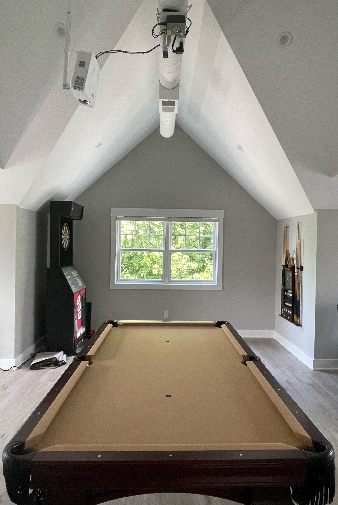
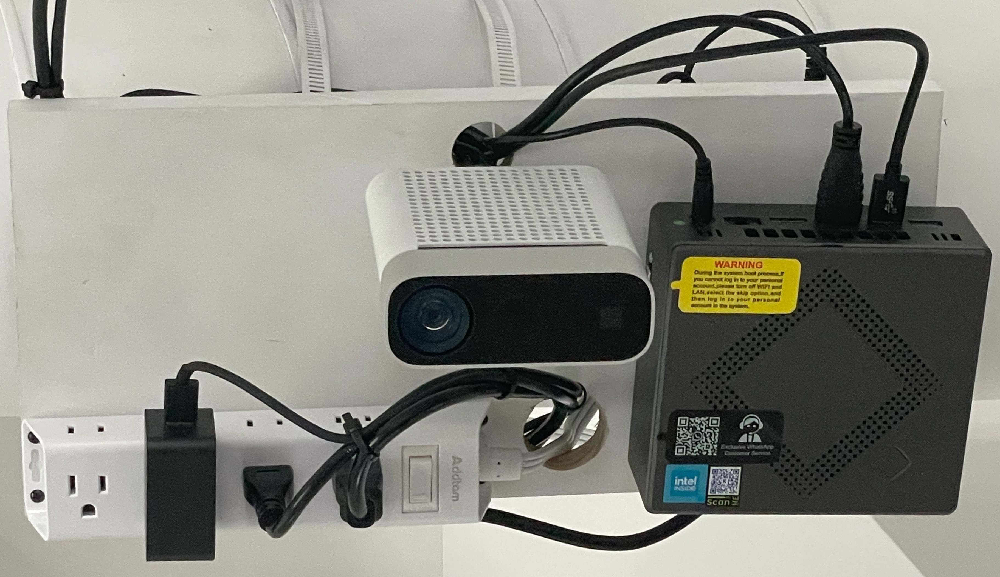

## OpenPool 2
This is OpenPool for Azure Kinect DK.
___
## Table of Contents
- [Hardware](#hardware)
  - [Billiards Table](#billiards-table)
  - [Projector](#projector)
  - [Mini PC](#mini-pc)
  - [Azure Kinect DK](#azure-kinect-dk)
- [Installation](#installation)
  - [Physical](#physical)

## Hardware
### Billiards Table
**Size:** 7-9ft  
**Cloth Color:** Gray or gold cloth is recommended for the best experience.

### Projector
**Recommended:** [UHD35STx](https://www.amazon.com/dp/B09XVNJNXT?ref=ppx_yo2ov_dt_b_product_details&th=1)  
The UHD35STx has 4 corner geometric correction which simplifies tightly fitting the image to the edges of the rails.  

You'll need to attach the projector vertically onto the ceiling.  I used [this](https://www.amazon.com/dp/B09P1G3L1D?ref=ppx_yo2ov_dt_b_product_details&th=1) standard ceiling mount.  

**Considerations**
- Throw Ratio
- Brightness
- Latency
- Lens Offset
- Zoom

### Mini PC
**Recommended:** [KAMRUI CK10](https://www.amazon.com/dp/B0B4J68GHM?ref=ppx_yo2ov_dt_b_product_details&th=1)

**Minimum Requirements**
- i7 10th Gen CPU (lower should work but has not been tested) 
- DX11 Capable GPU
- Intel USB 3.0 chipset
- 8GB RAM
- Windows 10 or 11 (64 bit)
- Mouse and Keyboard

**Optional**
- Bluetooth/Wifi
- Speaker

### Azure Kinect DK
Can be purchased direct from [Microsoft](https://www.microsoft.com/en-us/d/azure-kinect-dk/8pp5vxmd9nhq?activetab=pivot:overviewtab)  

You'll need to mount the camera as well.  I used [this](https://www.amazon.com/dp/B0747F8BWN?ref=ppx_yo2ov_dt_b_product_details&th=1), but would recommend something with an extension for cable clearance.

## Installation
### Physical
**Projector**  
The projector should be mounted from the ceiling near the edge of the table due to the lens offset.  Calculate how high it needs to be from the table bed using it's throw distance and your table size.  The projected image should cover to the outside edges of the cloth on the rails.

**Mini PC**  
The Mini PC should be relatively close to the Azure Kinect DK to keep the USB cable as short as possible.

**Azure Kinect DK**  
The Azure Kinect DK must be as close as possible to the exact center of the table and pointing directly at the center of the table.  The size of the table will determine how much distance you need between the lens of the Azure Kinect and the table top.  
**7ft Table:** 4.5ft  
**8ft Table:** 5.25ft  
**9ft Table:** 6ft

**My Setup**  

### Software
**Required**  
- Set display resolution (Recommend: 1080P at 60Hz or 120Hz)
- Download and install the [Azure Kinect SDK](https://download.microsoft.com/download/3/d/6/3d6d9e99-a251-4cf3-8c6a-8e108e960b4b/Azure%20Kinect%20SDK%201.4.1.exe)
- Download and install the [Azure Kinect Firmware](https://download.microsoft.com/download/3/d/6/3d6d9e99-a251-4cf3-8c6a-8e108e960b4b/AzureKinectDK_Fw_1.6.110079014.bin) ([Docs](https://learn.microsoft.com/en-us/azure/kinect-dk/azure-kinect-firmware-tool))
- Download the latest OpenPool release (TODO: Link)

**Recommended**
- Configure Mini PC to boot after power loss
- Configure auto login for the Mini PC
- Set OpenPool to autostart
- Set power settings to never go to sleep when plugged in
- Set power settings to never turn the screen off when plugged in 
